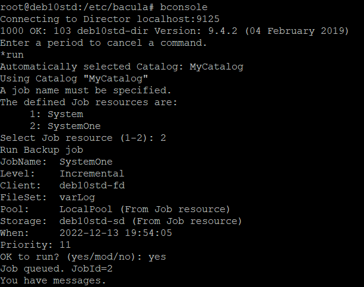
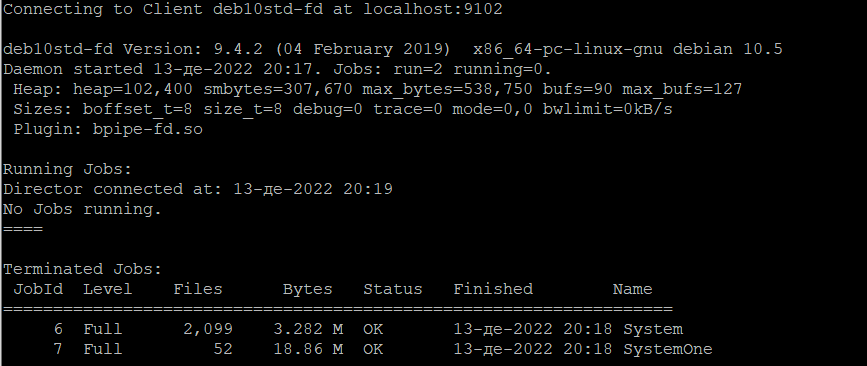
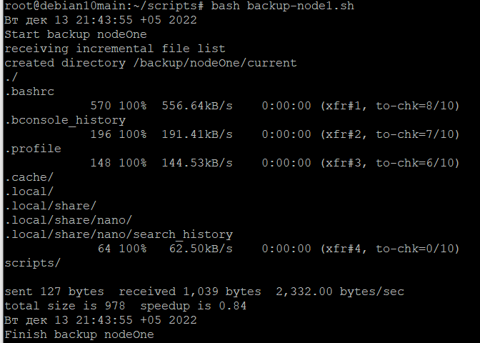

# Домашнее задание к занятию "10.4 Резервное копирование" - Неудахин Денис

### Задание 1.

В чем отличие между:

- полное резервное копирование,
- дифференциальное резервное копирование,
- инкрементное резервное копирование.


---

### Задание 2.

Установите программное обеспечении Bacula, настройте bacula-dir, bacula-sd,  bacula-fd. Протестируйте работу сервисов (трех сервисов).

bacula-dir
```
Director {                            # define myself
  Name = deb10std-dir
  DIRport = 9125                # where we listen for UA connections
  QueryFile = "/etc/bacula/scripts/query.sql"
  WorkingDirectory = "/var/lib/bacula"
  PidDirectory = "/run/bacula"
  Maximum Concurrent Jobs = 20
  Password = "BmwVXhbHjt6XVASj3vGJgNxjZ6QYi5iio"         # Console password
  Messages = Daemon
  DirAddress = 127.0.0.1
}

JobDefs {
  Name = "DefaultJob"
  Type = Backup
  Level = Incremental
  Client = deb10std-fd
  FileSet = "System"
  Schedule = "WeeklyCycle"
  Storage = deb10std-sd
  Messages = Standard
  Pool = LocalPool
  SpoolAttributes = yes
  Priority = 10
  Write Bootstrap = "/var/lib/bacula/%c.bsr"
}


Job {
  Name = "System"
  JobDefs = "DefaultJob"
  Enabled = yes
  FileSet="System"
  Schedule = "WeeklyCycle"
  Priority = 11                   # run after main backup
  Storage = deb10std-sd
  Pool = "LocalPool"
}

Job {
  Name = "SystemOne"
  JobDefs = "DefaultJob"
  Enabled = yes
  FileSet="varLog"
  Schedule = "WeeklyCycle"
  Priority = 11                   # run after main backup
  Storage = deb10std-sd
  Pool = "LocalPool"

}

FileSet {
  Name = "System"
  Include {
    Options {
      Signature = MD5
    }
    File = /etc
  }
}

FileSet {
  Name = "varLog"
  Include {
    Options {
      signature = sha1
    }
    File = /var/log
  }
}


Schedule {
  Name = "WeeklyCycle"
  Run = Full hourly at 18:00
}


Client {
  Name = deb10std-fd
  Address = localhost
  FDPort = 9102
  Catalog = MyCatalog
  Password = "c9DAhYWeqR8GnnvgyfRDxwvJyliWuV33d"          # password for FileDaemon
  File Retention = 60 days            # 60 days
  Job Retention = 6 months            # six months
  AutoPrune = yes                     # Prune expired Jobs/Files
}

Autochanger {
  Name = deb10std-sd
  Address = localhost                # N.B. Use a fully qualified name here
  SDPort = 9106
  Password = "M221CObdIHPE5uPkV2u22UAYzp6l2kVpW"
  Device = Local-Device
  Media Type = File
  Maximum Concurrent Jobs = 10        # run up to 10 jobs a the same time
  Autochanger = deb10std-sd                 # point to ourself
}

Autochanger {
  Name = debian10std2-sd
  Address = localhost                # N.B. Use a fully qualified name here
  SDPort = 9106
  Password = "M221CObdIHPE5uPkV2u22UAYzp6l2kVpW"
  Device = remote-Device
  Media Type = File
  Autochanger = deb10std-sd                 # point to ourself
  Maximum Concurrent Jobs = 10        # run up to 10 jobs a the same time
}

Catalog {
  Name = MyCatalog
  dbname = "bacula"; DB Address = "localhost"; dbuser = "bacula"; dbpassword = "8408"
}

Messages {
  Name = Standard
  operator = root = mount
  console = all, !skipped, !saved
  append = "/var/log/bacula/bacula.log" = all, !skipped
  catalog = all
}


Messages {
  Name = Daemon
  console = all, !skipped, !saved
  append = "/var/log/bacula/bacula.log" = all, !skipped
}

Pool {
  Name = LocalPool
  Pool Type = Backup
  Recycle = yes                       # Bacula can automatically recycle Volumes
  AutoPrune = yes                     # Prune expired volumes
  Volume Retention = 365 days         # one year
  Maximum Volume Bytes = 6G          # Limit Volume size to something reasonable
  Maximum Volumes = 100               # Limit number of Volumes in Pool
  Label Format = "Local-"
}

Console {
  Name = deb10std-mon
  Password = "0kYpPUrallSZzRDecrxVoyJZw01gBSIdT"
  CommandACL = status, .status
}
```
bacula-sd

```
Storage {                             # definition of myself
  Name = deb10std-sd
  SDPort = 9106                  # Director's port
  WorkingDirectory = "/var/lib/bacula"
  Pid Directory = "/run/bacula"
  Plugin Directory = "/usr/lib/bacula"
  Maximum Concurrent Jobs = 20
  SDAddress = 127.0.0.1
}

Director {
  Name = deb10std-dir
  Password = "M221CObdIHPE5uPkV2u22UAYzp6l2kVpW"
}

Director {
  Name = deb10std-mon
  Password = "gu3S8_1If6SVnErxSFybtzEN3WJlLZrZj"
  Monitor = yes
}

Device {
  Name = Local-Device
  Media Type = File
  Archive Device = /backup
  LabelMedia = yes;                   # lets Bacula label unlabeled media
  Random Access = Yes;
  AutomaticMount = yes;               # when device opened, read it
  RemovableMedia = no;
  AlwaysOpen = yes;
  Maximum Concurrent Jobs = 5
}

Device {
  Name = remote-Device
  Media Type = File
  Archive Device = /picap
  LabelMedia = yes;                   # lets Bacula label unlabeled media
  Random Access = Yes;
  AutomaticMount = yes;               # when device opened, read it
  RemovableMedia = no;
  AlwaysOpen = yes;
  Maximum Concurrent Jobs = 5
}

Messages {
  Name = Standard
  director = deb10std-dir = all
}
```
bacula-fd

```
Director {
  Name = deb10std-dir
  Password = "c9DAhYWeqR8GnnvgyfRDxwvJyliWuV33d"
}

Director {
  Name = deb10std-mon
  Password = "eyNW3n_FUS-2I-TM00wO3lnPniZFByuVo"
  Monitor = yes
}

FileDaemon {                          # this is me
  Name = deb10std-fd
  FDport = 9102                  # where we listen for the director
  WorkingDirectory = /var/lib/bacula
  Pid Directory = /run/bacula
  Maximum Concurrent Jobs = 20
  Plugin Directory = /usr/lib/bacula
  FDAddress = 127.0.0.1
}

Messages {
  Name = Standard
  director = deb10std-dir = all, !skipped, !restored
}
```

bconsole

```
#
# Bacula User Agent (or Console) Configuration File
#
# Copyright (C) 2000-2015 Kern Sibbald
# License: BSD 2-Clause; see file LICENSE-FOSS
#

Director {
  Name = deb10std-dir
  DIRport = 9125
  address = localhost
  Password = "BmwVXhbHjt6XVASj3vGJgNxjZ6QYi5iio"
}

```

Результат



---

### Задание 3.

Установите программное обеспечении rsync. Настройте синхронизацию на двух нодах. Протестируйте работу сервиса.

Node 1

rsyncd.conf
```
pid file = /var/run/rsyncd.pid
log file = /var/log/rsyncd.log
transfer logging = true
munge symlinks = yes
[data]
path = /root/
uid = root
read only = yes
list = yes
comment = Data backup Dir ][a][a][a
auth users = backup
secrets file = /etc/rsyncd.scrt
[new]
path = /etc/
uid = root
read only = yes
list = yes
comment = System fileset
auth users = backup
secrets file = /etc/rsyncd.scrt
```

rsyncd.scrt
```
backup:12345
```

Node 2

backup-node1.sh
```
#!/bin/bash
date
# Папка, куда будем складывать архивы — ее либо сразу создать либо несоздавать а положить в уже су$
syst_dir=/backup/
# Имя сервера, который архивируем
srv_name=nodeOne #из тестовой конфигурации
# Адрес сервера, который архивируем
srv_ip=192.168.0.105
# Пользователь rsync на сервере, который архивируем
srv_user=backup
# Ресурс на сервере для бэкапа
srv_dir=data
echo "Start backup ${srv_name}"
# Создаем папку для инкрементных бэкапов
mkdir -p ${syst_dir}${srv_name}/increment/
/usr/bin/rsync -avz --progress --delete --password-file=/etc/rsyncd.scrt ${srv_user}@${srv_ip}::${srv_dir} ${syst_dir}${srv_name}/current/ --backup --backup-dir=${syst_dir}${srv_name}/$
/usr/bin/find ${syst_dir}${srv_name}/increment/ -maxdepth 1 -type d -mtime +30 -exec rm -rf {} \;
date
echo "Finish backup ${srv_name}"
```

rsyncd.scrt
```
12345
```

Вывод выполнения скрипта




---
