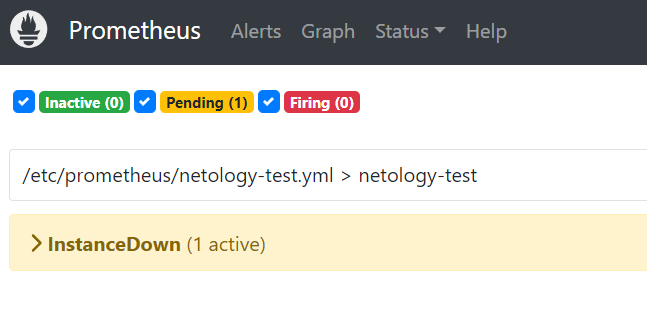
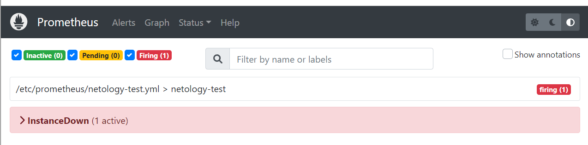
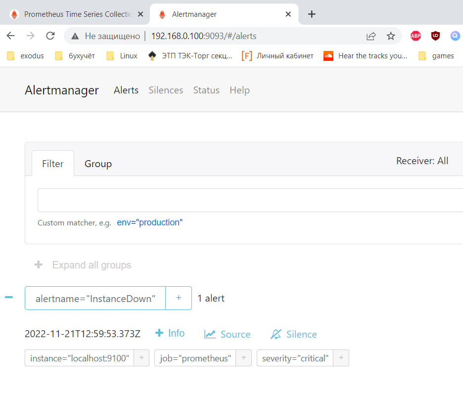
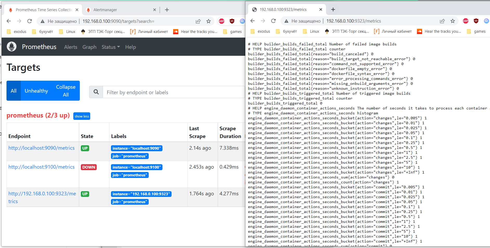

# Домашнее задание к занятию "9.5. Prometheus Ч.2 - Неудахин Денис"

### Задание 1. 

Создайте файл с правилом оповещения, как в лекции, и добавьте его в конфиг Prometheus.

*Погасите node exporter, стоящий на мониторинге, и прикрепите скриншот раздела оповещений Prometheus, где оповещение будет в статусе Pending.*

---

### Задание 2. 

Установите Alertmanager и интегрируйте его с Prometheus.

*Прикрепите скриншот Alerts из Prometheus, где правило оповещение будет в статусе Fireing, и скриншот из Alertmanager, где будет видно действующее правило оповещения.*

---

### Задание 3. 

Активируйте экспортер метрик в Docker и подключите его к Prometheus.

*Приложите скриншот браузера с открытым эндпоинтом, а также скриншот списка таргетов из интерфейса Prometheus.*

---
