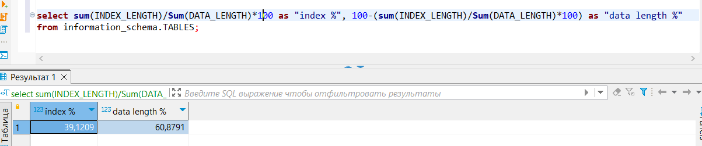

# Домашнее задание к занятию 12.4. «SQL. Часть 2»-Неудахин Денис

### Задание 1

Одним запросом получите информацию о магазине, в котором обслуживается более 300 покупателей, и выведите в результат следующую информацию: 
- фамилия и имя сотрудника из этого магазина;
- город нахождения магазина;
- количество пользователей, закреплённых в этом магазине.

	Условие в больше 300 покупателей задаётся подзапросом, он группирует магазины по store_id и выводит список(тут выводит список, в задании лишь store_id) по количеству клиентов связанных со store_id. 
Внизу я указал наглядно как это происходит. В самом задание я беру из этой таблица лишь store_id магазина где больше всего клиентов и задаю условие по выводу таблицы ограничивая лишь нужным мне store_id.

### Задание 2

Получите количество фильмов, продолжительность которых больше средней продолжительности всех фильмов.

### Задание 3

Получите информацию, за какой месяц была получена наибольшая сумма платежей, и добавьте информацию по количеству аренд за этот месяц.

Добавлено ограничение по году.

