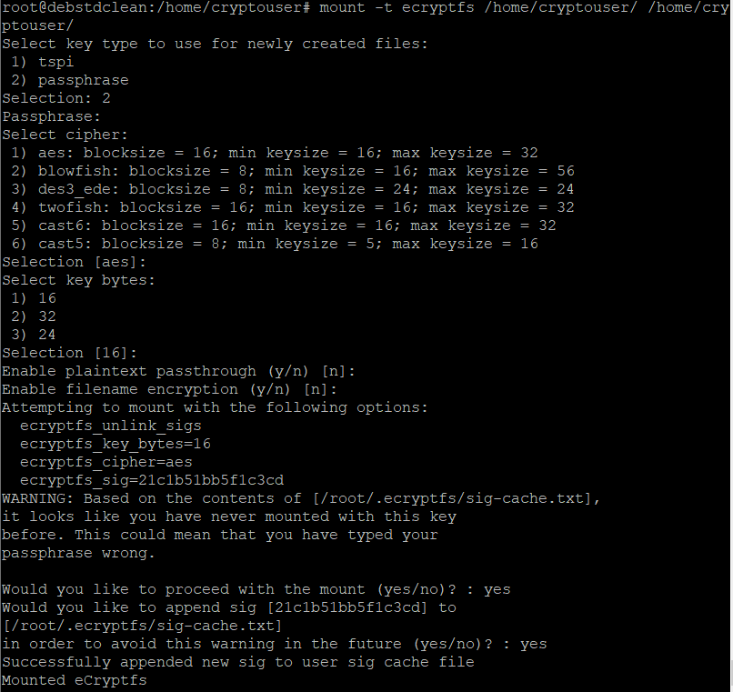
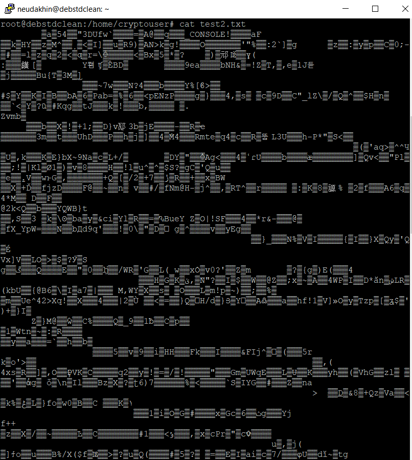
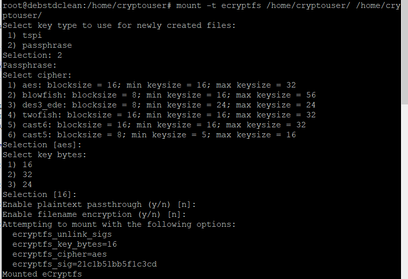

# Домашнее задание к занятию 13.2. «Защита хоста»-Неудахин Денис
------

### Задание 1

1. Установите **eCryptfs**.
2. Добавьте пользователя cryptouser.
3. Зашифруйте домашний каталог пользователя с помощью eCryptfs.

*В качестве ответа  пришлите снимки экрана домашнего каталога пользователя с исходными и зашифрованными данными.*  

Создаём пользователя и файл с текстом test в домашнем катологе cryptouser.

Попытка открыть зашифрованный файл.

Монтируем зашифрованный каталог, файл снова читаем.

### Задание 2

1. Установите поддержку **LUKS**.
2. Создайте небольшой раздел, например, 100 Мб.
3. Зашифруйте созданный раздел с помощью LUKS.

*В качестве ответа пришлите снимки экрана с поэтапным выполнением задания.*

