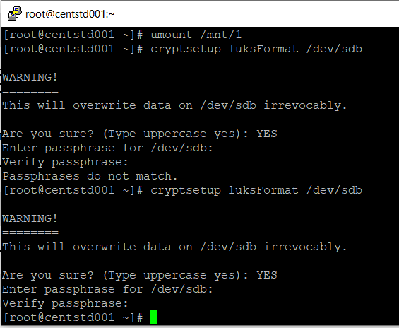
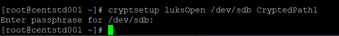

# Домашнее задание к занятию 12.6. «Репликация и масштабирование. Часть 1» - Неудахин Денис

---

### Задание 1

На лекции рассматривались режимы репликации master-slave, master-master, опишите их различия.

*Ответить в свободной форме.*

Основное различие заключается в том что при реплакации master-slave все изменения данных происходят на master сервере, а slave лишь копирует все данные с мастер для чтения. В master-master изменения в данных возможны на обеих серверах после чего сервера обмениваются ими. 

---

### Задание 2

Выполните конфигурацию master-slave репликации, примером можно пользоваться из лекции.

*Приложите скриншоты конфигурации, выполнения работы: состояния и режимы работы серверов.*

Конфигурация

Вторая slave нода

---

## Дополнительные задания (со звёздочкой*)
Эти задания дополнительные, то есть не обязательные к выполнению, и никак не повлияют на получение вами зачёта по этому домашнему заданию. Вы можете их выполнить, если хотите глубже шире разобраться в материале.

---

### Задание 3* 

Выполните конфигурацию master-master репликации. Произведите проверку.

*Приложите скриншоты конфигурации, выполнения работы: состояния и режимы работы серверов.*